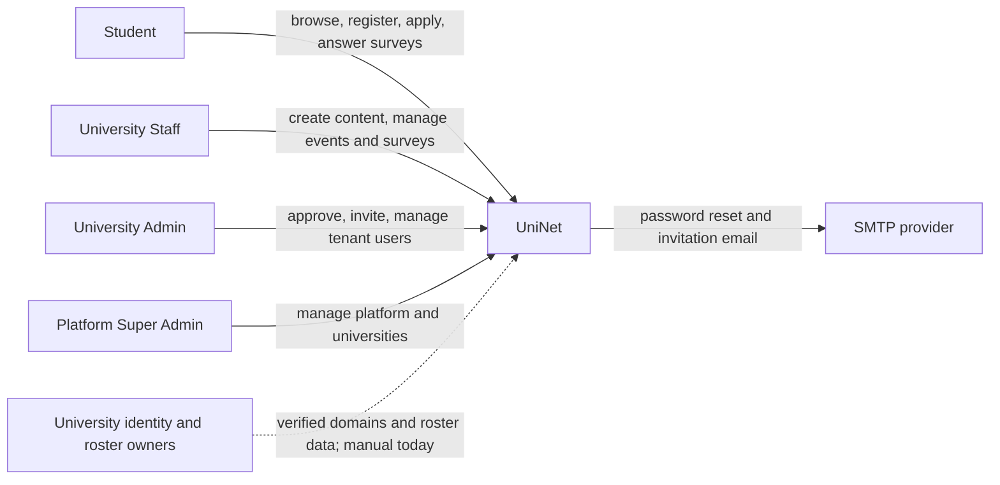
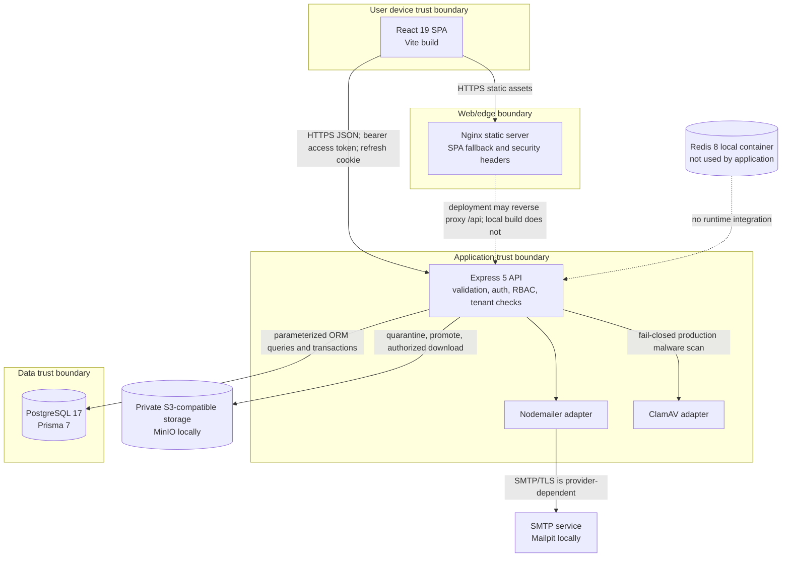

# UniNet architecture

## System context



University roster CSV import and domain ownership verification are not complete
automated integrations. The dashed relationship represents an operating process,
not a live upstream connector.

## Container view



In the current local topology the browser calls `VITE_API_URL` directly. A
production edge may proxy `/api`, but that behavior is not in the committed Nginx
configuration and must be tested before deployment.

## Component view

```mermaid
flowchart LR
  subgraph Frontend
    Landing[Landing/auth shell]
    Client[Central API client\ntimeouts, 401 refresh queue]
    Auth[Auth service and role guards]
    StudentUI[Student experience]
    OpsUI[Staff/Admin/Platform experience]
    SettingsUI[Settings and privacy UI]
  MembershipUI[Membership UI]
    FileUI[Student CV/avatar upload]
  end

  subgraph Backend
    Cross[Request ID, logging, CORS, Helmet, parsers, errors]
    AuthAPI[Auth router/service/repository]
    StudentAPI[Student router]
    OpsAPI[Operations router]
    MembershipAPI[Membership service/repository]
    SurveyAPI[Survey router/validation]
    PrivacyAPI[Privacy and settings routers]
    OtherAPI[Public, notifications, health, OpenAPI]
    FileAPI[File policy, authorization, storage and scanner]
    Prisma[Prisma client]
  end

  Landing --> Auth --> Client
  StudentUI --> Client
  OpsUI --> Client
  SettingsUI --> Client
  MembershipUI --> Client
  FileUI --> Client
  Client --> Cross
  Cross --> AuthAPI & StudentAPI & OpsAPI & MembershipAPI & SurveyAPI & PrivacyAPI & OtherAPI & FileAPI
  AuthAPI & StudentAPI & OpsAPI & MembershipAPI & SurveyAPI & PrivacyAPI & OtherAPI & FileAPI --> Prisma
```



The backend is a modular monolith. Auth and membership have explicit
service/repository boundaries; several other modules currently keep domain logic
inside route modules. Request-scoped dependency injection is not consistently
implemented.

## Module ownership boundaries

| Boundary | Primary code | Owns |
| --- | --- | --- |
| Browser transport | `src/api/apiClient.js` | access-token memory, cookie credentials, timeout, error envelope, one refresh queue |
| Browser auth | `src/auth/` | current user, role routing, UI guards; never authoritative authorization |
| Student | `src/student/`, `server/src/student/` | feed, save, registration, waitlist, ticket, applications, student notifications |
| Operations | `src/operations/`, `server/src/operations/` | content lifecycle, approvals, attendance, application state, university and partnership actions |
| Membership | `src/memberships/`, `server/src/memberships/` | Staff/Admin invitations, tenant member status and Staff permissions |
| Surveys | operations/student UI and `server/src/surveys/` | schema validation, lifecycle, responses, aggregates, CSV report |
| Privacy/settings | `src/settings/`, `server/src/privacy/`, `server/src/settings/` | policy acceptance, consent, exports, settings, account requests |
| Authentication | `server/src/auth/` | registration/login, sessions, refresh rotation, reset tokens, mail adapter |
| Files | `server/src/files/` | private CV/avatar validation, quarantine, malware scan, S3 storage, authorized download/delete |
| Cross-cutting API | `server/src/middleware/`, `server/src/observability/` | authentication, RBAC helpers, request IDs, rate limits, normalized errors, redaction |
| Persistence | `server/prisma/`, `server/src/lib/prisma.js` | schema, indexes, migrations, seed, PostgreSQL connection |

## Principal data flows

### Login and refresh

```mermaid
sequenceDiagram
  actor U as User
  participant B as Browser SPA
  participant A as Express API
  participant D as PostgreSQL

  U->>B: submit email and password
  B->>A: POST /api/auth/login
  A->>D: load user; verify ACTIVE user/university
  A->>A: verify Argon2id password
  A->>D: create hashed refresh session family
  A-->>B: access JWT in JSON + HttpOnly SameSite=Strict refresh cookie
  Note over B: access JWT stays in memory
  B->>A: authenticated request with Bearer JWT
  A->>D: verify referenced session and user state
  A-->>B: response
  B->>A: POST /api/auth/refresh with cookie
  A->>D: atomic rotate; revoke prior session
  A-->>B: new access JWT + rotated cookie
```

Concurrent browser `401` responses share one refresh promise. Reuse of a rotated
refresh token compromises and revokes its token family. Logout-all revokes all
sessions for the user.

### Student registration

1. The API validates a strict registration schema and current required policy IDs.
2. It normalizes the email and matches an active, verified `UniversityDomain` when
   one exists. Client-supplied role or university is not accepted.
3. It hashes the password with Argon2id and atomically creates the Student, profile,
   policy acceptances, and session.
4. Public registration currently activates the Student immediately. Email
   verification is not implemented.

### Content publication and visibility

1. Staff with `canCreateContent`, University Admin, or Platform Super Admin creates
   content for an authorized tenant.
2. Server state-transition rules control draft, approval, publication, rejection,
   archive, and expiry. Version checks prevent lost updates.
3. Publication creates notifications based on `PRIVATE`, `PARTNERS`, `NETWORK`, or
   `PUBLIC` visibility.
4. Student queries recalculate authorized scope server-side; the UI does not decide
   tenant access.

### Event registration and attendance

1. A serializable transaction assigns `CONFIRMED` or `WAITLISTED` based on capacity.
2. Cancellation promotes the earliest waiter and renumbers the remaining waitlist.
3. A confirmed Student requests a signed, expiring QR token. The QR contains no
   authoritative profile data.
4. An authorized operator submits the token; the server verifies its HMAC, event,
   registration, user, code, tenant, and current state before recording attendance.

### Invitations

University Admin may invite Staff in the same tenant; Platform Super Admin may
invite a University Admin for a selected university. Opaque invitation tokens are
stored as hashes, expire, are single-use, and are revoked when email delivery fails.

## Runtime characteristics

- JSON and form bodies are limited to 100 KiB.
- Liveness is `/live` or `/api/health`; readiness is `/ready` or `/api/ready` and
  requires a successful PostgreSQL query.
- Structured JSON access logs are written to standard output with a request ID.
- `SIGINT`/`SIGTERM` trigger bounded graceful HTTP and database shutdown.
- S3-compatible object storage and ClamAV adapters are present. Production provider,
  cleanup/lifecycle worker, and object backup/restore evidence are not.
- There is no durable queue, cache integration, WebSocket channel, or scheduled
  worker in the current application.

## Related decisions

- [ADR-0001: browser sessions](adr/0001-browser-session-tokens.md)
- [ADR-0002: tenancy and RBAC](adr/0002-multi-tenancy-and-rbac.md)
- [ADR-0003: Prisma and PostgreSQL](adr/0003-prisma-postgresql.md)
- [ADR-0004: API compatibility](adr/0004-api-compatibility.md)
- [ADR-0005: private file storage](adr/0005-private-object-storage.md)
