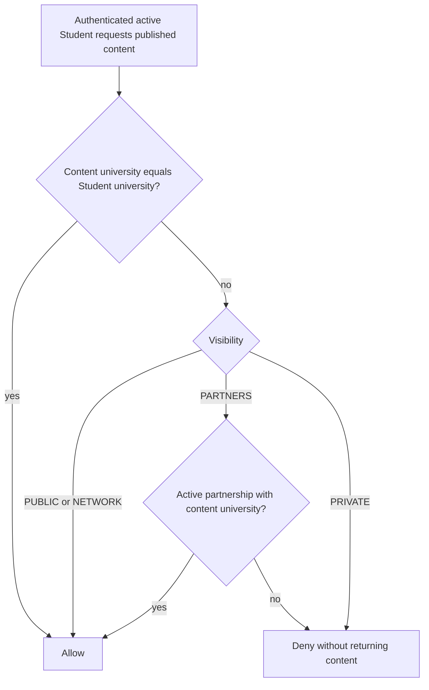
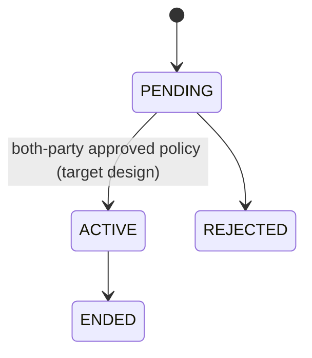

# Roles, permissions, and tenant visibility

Authorization is enforced by the API. React `RoleGuard` and `PermissionGuard` only
improve navigation and must never be treated as a security boundary.

## Role matrix

| Capability | Student | Staff | University Admin | Platform Super Admin |
| --- | --- | --- | --- | --- |
| View authorized published content | Yes | Operations view | Tenant operations view | Platform-wide operations view |
| Save content / register for event / apply | Yes | No | No | No |
| Submit published survey | Yes | No | No | No |
| Create and edit tenant content | No | With `canCreateContent` | Yes | Yes |
| Publish/approve content | No | With `canPublish` | Yes | Yes |
| Manage event registrations/attendance | No | With `canManageRegistrations` | Yes | Yes |
| Manage applications | Own only | With `canManageApplications` | Yes | Yes |
| Create/manage surveys | Answer only | With `canManageSurveys` | Yes | Yes |
| View survey reports/export | No | With `canViewReports` | Yes | Yes |
| Invite Staff | No | No | Same university | No through Staff flow |
| Manage tenant Student/Staff status | No | No | Same university | Not through tenant membership endpoints |
| Change Staff permission flags | No | No | Same university | Not through tenant membership endpoints |
| Invite University Admin | No | No | No | For selected university |
| Create/change university status | No | No | No | Yes |
| Platform-wide operations bootstrap/audit | No | No | No | Yes |

The Platform Super Admin is intentionally not treated as a University Admin by the
membership list/update endpoints. This avoids an implicit cross-tenant bypass; a
separate platform action must be explicitly implemented and audited when needed.

## Staff permissions

| Database flag | Client name | Server use |
| --- | --- | --- |
| `canCreateContent` | `CREATE_CONTENT` | create and edit content |
| `canPublish` | `PUBLISH_CONTENT` | approve/publish content |
| `canManageRegistrations` | `MANAGE_REGISTRATIONS` | registration data and QR attendance |
| `canManageApplications` | `MANAGE_APPLICATIONS` | application transitions |
| `canManageSurveys` | `MANAGE_SURVEYS` | survey create/edit/status/delete |
| `canViewReports` | `VIEW_REPORTS` | survey responses, CSV, and report data |

University Admin and Platform Super Admin bypass Staff permission flags only in
modules that explicitly authorize those roles. Every new route must call
`authenticate`, authorize a role/permission, and assert tenant ownership before
reading or mutating a resource.

## Tenant rules

- Non-platform operations queries are scoped to `req.auth.user.universityId`.
- A resource fetched by ID must be checked again with `assertTenant`; hiding it in a
  list is not sufficient.
- Membership operations derive University Admin tenant from the authenticated
  actor, not from a request body.
- Staff invitations must use an active, verified domain belonging to the Staff's
  university.
- University status is checked on login, refresh, and access-token authentication.
  Suspending a university revokes active sessions in the implemented platform
  status action.
- Platform Super Admin operations are cross-tenant by design. High-risk platform
  step-up authentication and dual approval are not implemented.

PostgreSQL row-level security (RLS) is not enabled. The current decision and revisit
criteria are in [ADR-0002](adr/0002-multi-tenancy-and-rbac.md).

## Content visibility

Only `PUBLISHED` content is returned to Students.

| Visibility | Student audience |
| --- | --- |
| `PRIVATE` | Students in the content's own university |
| `PARTNERS` | Own university plus universities in an active partnership |
| `NETWORK` | All active Students in UniNet |
| `PUBLIC` | All active Students; public unauthenticated content exposure is not implied |

`PUBLIC` currently means network-wide visibility in authenticated Student queries;
it does not automatically create a public anonymous detail endpoint.

The same decision must be applied to detail and mutation reads; filtering a feed
alone does not prevent an IDOR.

Survey visibility is narrower: a Student can see a published platform survey
(`universityId = null`) or a published survey for their own university. Partner
visibility is not implemented for surveys.

## Partnership rules

A partnership connects two distinct universities and has `PENDING`, `ACTIVE`,
`REJECTED`, or `ENDED` state. Partner content becomes visible only when the
partnership is active and the content is explicitly `PARTNERS`. `NETWORK` does not
depend on partnership state.

The generic operations action endpoint checks that a non-platform actor belongs to
one side before a partnership state change. A dedicated invitation/acceptance API,
dual-party approval policy, and comprehensive state-machine tests remain incomplete.

This diagram is the intended safe lifecycle. The current generic operations action
does not yet enforce this complete transition/dual-party policy, so it is a design
constraint and an implementation gap rather than a proven control.

## Authorization review checklist

For every new endpoint:

1. Validate the bearer token and database session.
2. Check active User and University status.
3. Authorize the role and, for Staff, the exact permission.
4. Derive tenant scope from the authenticated actor.
5. Re-check tenant after loading a resource by ID.
6. Validate state transition and ownership.
7. Use a transaction for mutation plus history/audit where atomicity matters.
8. Return `403` without leaking another tenant's data; consider `404` where
   existence itself is sensitive.
9. Add allow/deny tests for every role and cross-tenant case.
