# Data model and ERD

The source of truth is [`server/prisma/schema.prisma`](../server/prisma/schema.prisma).
This document is a conceptual aid; migrations, constraints, and generated Prisma
types remain authoritative.

## Conceptual ERD

```mermaid
erDiagram
  UNIVERSITY ||--o{ UNIVERSITY_DOMAIN : owns
  UNIVERSITY ||--o{ UNIVERSITY_MEMBER : imports
  UNIVERSITY ||--o{ USER : contains
  USER ||--o| STUDENT_PROFILE : has
  USER ||--o| STAFF_PROFILE : has
  USER ||--o{ SESSION : authenticates
  USER ||--o{ PASSWORD_RESET_TOKEN : resets
  UNIVERSITY ||--o{ UNIVERSITY_INVITATION : issues_for
  USER ||--o{ UNIVERSITY_INVITATION : sends

  UNIVERSITY ||--o{ CONTENT : publishes
  USER ||--o{ CONTENT : creates
  CONTENT ||--o{ CONTENT_STATUS_HISTORY : transitions
  USER ||--o{ SAVED_CONTENT : saves
  CONTENT ||--o{ SAVED_CONTENT : saved_as
  USER ||--o{ EVENT_REGISTRATION : registers
  CONTENT ||--o{ EVENT_REGISTRATION : event
  USER ||--o{ APPLICATION : applies
  CONTENT ||--o{ APPLICATION : opportunity
  USER ||--o{ FILE_ASSET : owns
  UNIVERSITY ||--o{ FILE_ASSET : scopes
  FILE_ASSET ||--o{ APPLICATION : attached_to
  APPLICATION ||--o{ APPLICATION_STATUS_HISTORY : transitions

  UNIVERSITY ||--o{ SURVEY : scopes
  USER ||--o{ SURVEY : creates
  SURVEY ||--o{ SURVEY_RESPONSE : receives
  USER ||--o{ SURVEY_RESPONSE : submits

  USER ||--o| USER_SETTINGS : configures
  USER ||--o{ NOTIFICATION : receives
  USER ||--o{ CONSENT_RECORD : grants
  POLICY_DOCUMENT ||--o{ POLICY_ACCEPTANCE : accepted_as
  USER ||--o{ POLICY_ACCEPTANCE : accepts
  USER ||--o{ ACCOUNT_ACTION_REQUEST : requests
  USER ||--o{ AUDIT_LOG : acts
  USER ||--o{ FEEDBACK : sends
  USER ||--o{ IDEMPOTENCY_RECORD : owns

  UNIVERSITY ||--o{ PARTNERSHIP : requests
  UNIVERSITY ||--o{ PARTNERSHIP : receives
```

## Identity and tenant records

| Model | Purpose and important invariants |
| --- | --- |
| `University` | Tenant/workspace. Unique name, short name, and slug; lifecycle status gates users. |
| `UniversityDomain` | Globally unique normalized domain. Registration and invitation matching require active, verified domain rows. |
| `User` | Globally unique email/normalized email, one role, optional university, lifecycle and legal-hold metadata. |
| `UniversityMember` | Imported roster identity; unique email per university plus nullable Student/employee identifiers. CSV import workflow is not implemented. |
| `StudentProfile` | One-to-one Student profile; Student ID is unique within a university when present. |
| `StaffProfile` | One-to-one Staff profile and six permission flags; employee code is tenant-unique when present. |
| `UniversityInvitation` | Hashed opaque invitation, tenant, sender, role, expiry, acceptance/revocation state. |

`PLATFORM_SUPER_ADMIN` is allowed to have no university. Staff and University Admin
operations require a university association. Role changes are not a public
registration input.

## Authentication records

`Session` stores only a SHA-256 hash of the refresh JWT plus family/rotation
metadata. A unique `rotatedFromId` makes one-successor rotation enforceable.
Revocation, compromise, expiry, last use, IP, and user agent are recorded. The
access JWT itself is not persisted.

`PasswordResetToken` stores a hash of a 256-bit opaque token, an expiry, and a
single-use timestamp. Password reset revokes active sessions.

There is no email-verification, OAuth account, MFA, recovery-code, or WebAuthn
model in the current schema.

## Private files

`FileAsset` is authoritative metadata for a private S3-compatible object: owner,
tenant, purpose, random storage key, SHA-256, detected MIME, original name, size,
quarantine/availability/deletion state, and malware scan evidence. Student profiles
reference current avatar/CV assets; Applications may retain a reviewed CV asset and
restrict its physical deletion. `ATTACHMENT` exists as an enum value but has no
accepted upload policy/route yet.

## Content and participation

- `Content` represents Event, Internship, Job, Research, and Announcement records.
  Global unique slug, tenant/status/visibility indexes, and an optimistic `version`
  support publication workflows.
- `ContentStatusHistory` and `ApplicationStatusHistory` retain actor, transition,
  reason, and time.
- `EventRegistration` is unique per user/event. Its random registration code is
  unique; status, waitlist position, cancellation, and attendance are authoritative
  database state.
- `Application` is unique per user/opportunity. Consent and status timestamps are
  retained.
- `SavedContent` is unique per user/content.

Most dependent participation rows cascade when their user or content is physically
deleted. Production physical deletion is not currently automated; see
[Privacy and retention](privacy-retention.md).

## Surveys

Survey questions and answers are JSON validated at the API boundary. `schemaVersion`
is copied into each response so reports can interpret the submitted shape. A user
may submit only one response per survey. The database does not independently
enforce JSON question shape; application validation is therefore security- and
integrity-critical.

## Privacy and policy evidence

- `PolicyDocument` is unique by type/version/locale. A PostgreSQL trigger prevents
  updating or deleting a published document's evidence fields; a new version must
  be published instead.
- `PolicyAcceptance` snapshots policy type, version, and checksum and is unique per
  user/document.
- `ConsentRecord` stores recipient, purpose, data fields, resource context,
  revocation, and a supersession chain.
- `AccountActionRequest` records deactivation/deletion lifecycle and legal holds.
  It is scheduling metadata, not proof that a deletion executor ran.

## Audit and operational records

`AuditLog` records actor, tenant, action, resource, before/after JSON, severity,
IP, user agent, and time. Unlike published policy documents, it has no database
trigger preventing update or delete. It must not be described as immutable.

`IdempotencyRecord` provides request identity and cached response columns. Critical
POST workflows such as registration/application, invitations, content/university,
surveys, privacy actions, feedback, and attendance mount the middleware; route
adoption must still be reviewed for every new mutation.

`Notification`, `Feedback`, and `UserSettings` provide database-backed UI data.
Notification delivery is in-app polling today; there is no durable delivery queue.

## Delete behavior

Prisma relations deliberately mix behaviors:

- identity-owned rows such as sessions and profiles generally `CASCADE` with User;
- tenant identity references generally `RESTRICT` to prevent accidental university
  deletion;
- attribution fields such as content creator/approver generally `SET NULL`;
- published policy acceptance → document is `RESTRICT`;
- tenant/content relations often `SET NULL` where historical platform content may
  remain.

Before adding a destructive operation, inspect the exact relation and run an
integration test against PostgreSQL. There is no universal soft-delete policy.

## Schema-change rules

1. Change `schema.prisma` and generate a named migration.
2. Review generated SQL, locking behavior, constraints, and delete effects.
3. Prefer expand/backfill/contract across releases for non-empty tables.
4. Run the complete migration chain and seed against a clean PostgreSQL database.
5. Follow the [migration runbook](runbooks/migrations.md).
