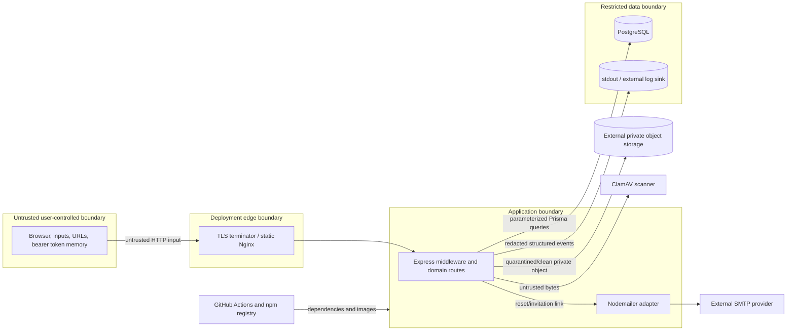

# UniNet threat model

- Review date: 2026-07-27
- Scope: the repository's React SPA, Express API, PostgreSQL data, SMTP adapter,
  container configuration, and CI
- Status: engineering threat model; no independent penetration test or OWASP ASVS
  certification has been performed

## Security objectives

1. A user can access only data permitted by role, Staff permission, university,
   content visibility, partnership, ownership, and current resource state.
2. Credentials, session tokens, reset/invitation tokens, and signing secrets are not
   disclosed or stored in plaintext.
3. Registrations, applications, approvals, surveys, consent, and policy evidence
   cannot be silently forged or altered through normal application paths.
4. Security-relevant activity is attributable without placing passwords, tokens, or
   direct PII in operational logs.
5. The service fails closed when production configuration, authentication, or a
   tenant check is invalid.

## Assets

- password hashes, access/refresh sessions, password-reset and invitation tokens;
- JWT and QR ticket signing keys, database and SMTP credentials;
- Student/Staff identity, contact, university affiliation, roster and profile data;
- CV links, applications, event registrations, attendance, survey responses;
- content, approval history, partnership state, notifications, reports and exports;
- policy versions/acceptance, consent history, deletion/legal-hold metadata;
- audit records, request logs, CI credentials, build artifacts and migration history.

## Attacker profiles

- unauthenticated bot performing enumeration, credential stuffing, spam, or denial
  of service;
- malicious or compromised Student attempting IDOR or cross-university access;
- compromised Staff account abusing granted capabilities;
- malicious University Admin targeting another tenant or escalating permissions;
- compromised Platform Super Admin with platform-wide impact;
- supply-chain attacker controlling a dependency, CI action, registry name, or build
  input;
- operator/database insider who can bypass application authorization;
- network attacker where TLS or proxy trust is misconfigured.

## Trust boundaries and data flow

The external TLS terminator, production log sink, SMTP provider, database service,
secret manager, and CI environment are not configured by this repository. Their
access controls and encryption require deployment evidence.

## STRIDE analysis

| Class | Representative threat | Implemented controls | Residual risk / required work |
| --- | --- | --- | --- |
| Spoofing | credential stuffing or stolen refresh token | Argon2id, generic reset response, auth rate limit, HttpOnly strict cookie, atomic refresh rotation/replay family revocation, active User/University/Session checks | MFA/passkeys, breached-password checks, distributed rate limiting, risk-based/step-up auth absent |
| Spoofing | forged university association | verified active domain lookup and invitation-domain match; client role/university ignored | DNS/administrative domain ownership workflow and email verification absent; an unmatched email may create a network-only Student account |
| Tampering | change content/application state or attendance | strict Zod schemas, server state machines, optimistic content versions, transactions, signed expiring QR, authoritative DB lookup | Audit rows are mutable by DB operators; not every mutation uses idempotency middleware |
| Tampering | edit accepted policy evidence | checksummed acceptance snapshot and DB trigger protecting published policy document evidence | privileged DB owner can disable trigger; no immutable external evidence store |
| Repudiation | deny an approval, permission, export, or deletion request | actor/tenant before-after AuditLog for many domain actions; request ID and structured logs | auth success/failure and several security events lack complete audit coverage; no immutable/central sink |
| Information disclosure | IDOR/cross-tenant query | API role, Staff permission, tenant predicates, post-fetch checks, explicit content visibility | application-only isolation; RLS absent; cross-role/cross-tenant integration coverage must expand |
| Information disclosure | secrets/PII in logs | recursive key redaction, URL query stripping, bounded values, no body access logging | external sink policy, retention, access review, and DLP are unconfigured |
| Information disclosure | XSS steals data/actions | memory-only access token, CSP/security headers, React escaping, URL scheme/host validation | CSP allows inline styles and Google Fonts; no independent DOM/ASVS review; future rich text needs a dedicated sanitizer |
| Information disclosure | unauthorized CV/avatar download | private object storage, database ownership/tenant/application-consent authorization, API-only attachment streaming | production bucket policy/workload identity/access audit not configured; database/storage drift needs reconciliation |
| Denial of service | oversized/frequent requests or expensive reports | 100 KiB body limits, endpoint rate limiters, pagination on key lists/reports, timeouts/readiness | in-process rate limiter is not shared across replicas; no WAF, queue, load test, or production capacity evidence |
| Elevation of privilege | request a higher role or tenant | public registration fixes role to Student; invitations constrain inviter/role/tenant; backend guards authoritative | Platform Super Admin lacks MFA/step-up/dual control; generic operations actions need continued review |
| Supply chain | vulnerable/malicious dependency or CI action | lockfile, pinned runtime, `npm ci`, audit, Dependabot, dependency review, gitleaks, full-SHA actions | no SBOM/signing/provenance, container digest pinning, or registry allowlist |

## Abuse cases

### Account and session abuse

- **Enumerate registered emails:** login/reset messages should remain generic; verify
  response timing and rate limits. Password reset request already returns a generic
  response.
- **Replay a refresh token:** the atomic compare-and-swap allows one successor; a
  reused ancestor compromises its family. Monitor `REFRESH_TOKEN_REUSED` once auth
  security audit/alerts exist.
- **Use a session after suspension:** every access loads the Session and User; login,
  refresh, and auth reject inactive User/University. Status mutation must revoke
  sessions in the same transaction.
- **Take over a privileged account:** password alone is currently sufficient. Do not
  launch privileged production access before MFA and step-up controls are accepted.

### Tenant and object access abuse

- **Change a URL ID to another university's record:** list predicates are not enough;
  detail/mutation routes must assert the loaded record's tenant and include negative
  tests.
- **Mark content `NETWORK` to exfiltrate private information:** publication permission
  and approval state exist, but universities also need governance/training. High-risk
  visibility changes should produce reviewable audit events.
- **Forge a partnership:** active partner scope comes from database records, not a
  request claim. Dedicated two-party acceptance is still incomplete.
- **Exploit Platform Super Admin:** its intentional cross-tenant scope has the largest
  blast radius; use isolated accounts, MFA/step-up, reason capture, and alerting when
  implemented.

### Workflow and integrity abuse

- **Overbook an event with concurrent requests:** registration uses serializable
  transactions/retries and a unique user/content constraint. Keep concurrency tests.
- **Forge or reuse a QR:** HMAC, expiry, event/registration/user/code checks and
  state transition protect attendance. Ticket-secret rotation invalidates all
  outstanding tickets.
- **Submit malformed survey answers:** server validates required/type/options/count
  against the stored schema version. CSV exports neutralize spreadsheet formulas.
- **Repeat a payment-like mutation:** there are no payments. The idempotency model and
  middleware exist, but protection is only real on routes that mount it.

### Data and availability abuse

- **Inject script/data URLs:** profile/application URLs permit HTTP(S), reject embedded
  credentials, and constrain GitHub/LinkedIn hosts. React text output remains escaped.
- **Upload malware/polyglot:** purpose-specific size/extension/magic MIME checks,
  active content rejection, quarantine and ClamAV are implemented. Production must
  monitor scanner signature freshness/capacity, reconcile orphan quarantine objects,
  and independently test parser/polyglot evasions.
- **Flood one replica:** current rate limits are process-local. Production needs an
  edge/distributed control and capacity-tested thresholds.
- **Delete evidence:** application deletion actions are audited, but a database owner
  can modify most audit rows. Restrict DB credentials and add immutable export/storage.

## OWASP-oriented review map

| Risk area | Current posture |
| --- | --- |
| Broken access control | server RBAC/permissions/tenant checks implemented; RLS, step-up, and exhaustive integration matrix pending |
| Cryptographic failures | Argon2id, hashed opaque tokens, HMAC tickets, TLS-only production config validation; KMS/key rollover and at-rest provider evidence pending |
| Injection | Prisma parameterization, strict Zod validation, simple Express query parser, CSV formula neutralization; manual query/review must continue |
| Insecure design | explicit state machines, threat model, ADRs; abuse-case tests and privileged controls remain |
| Security misconfiguration | production startup rejects placeholder/equal secrets, insecure DB/CORS/App URL; edge/provider config still requires review |
| Vulnerable components | lockfile, audit, Dependabot, dependency review; SBOM/signing pending |
| Authentication failures | rotating sessions/reset flow/rate limit; MFA/OAuth/email verification absent |
| Integrity failures | migration history and pinned Actions; artifact provenance/signing pending |
| Logging failures | request IDs/redacted JSON and domain audit; centralized alerts/retention/on-call pending |
| SSRF | no server-side arbitrary URL fetch currently; future webhooks/importers require egress allowlists and IP/DNS protections |

## Security test priorities

1. PostgreSQL integration tests covering every role × endpoint × own/other/global
   tenant scope.
2. Concurrency tests for refresh rotation, capacity/waitlist, invitation acceptance,
   status transitions, and idempotent mutations.
3. Browser tests for cookie attributes, CSRF/origin behavior, CSP, XSS payloads,
   session expiry, and accessibility-safe auth failures.
4. Fuzz/property tests for Zod boundaries, ticket parsers, CSV neutralization, URL
   validators, and log redaction.
5. Independent ASVS review and penetration test before production sign-off.

## Review triggers

Update this model when adding OAuth/MFA, file uploads/object storage, CSV roster
import, webhooks, a queue/worker, public content endpoints, RLS, a new service/data
store, a production provider, or a new privileged role. Record unresolved risks in
release notes rather than silently accepting them.
